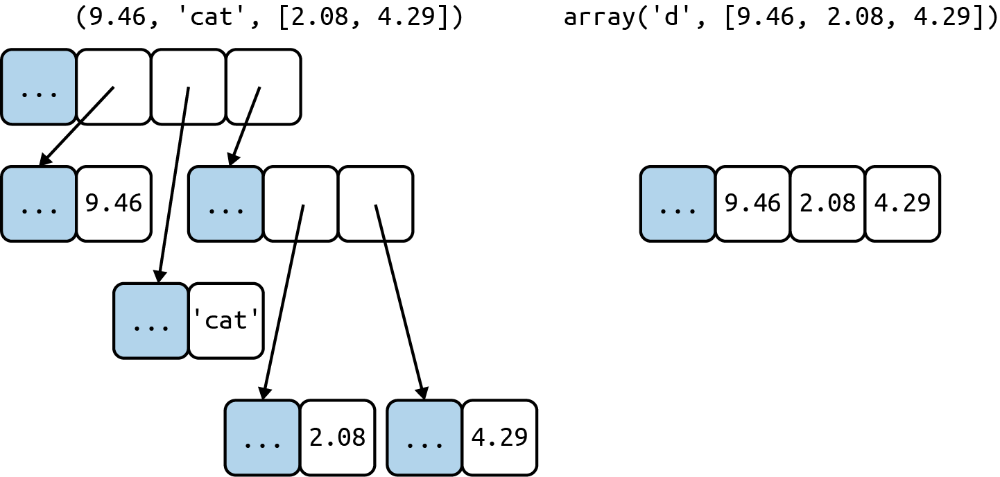
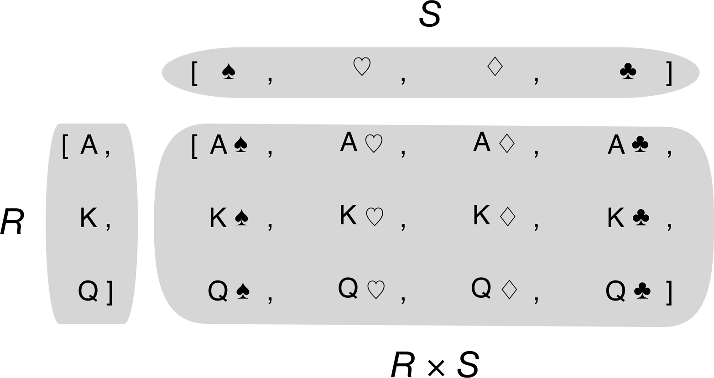

# Sequências:

## Sequências container: armazenam itens de tipos diferentes 
## Sequências planas: armazenam itens de algum tipo simples

## Sequências mutáveis: list, bytearray, array.array e collections.deque.
## Sequências imutáveis: tuple, str, e bytes.

## Produtos cartesianos: Listcomps podem criar listas a partir de um produto cartesiano de dois ou mais iteráveis 

## Listcomp: cria uma lista inteira na memória 
## expressão geradora: não cria lista, produz os valores um por vez e retorna um gerador. É ideal quando há um grande volume de dados

## List comprehension gera todos os valores de uma vez; expressão geradora gera sob demanda.

# Tuplas: contém registros, e cada elemento da tupla contém dados de um campo e a posição do item indica o significado.

## As tuplas usam menos memória que listas, porém as referências de uma tupla não podem ser apagadas ou substituídas.

## Se quisermos determinar se uma tupla tem um valor fixo, podemos usar a função hash, para criar uma função fixed.

# *args: usado para capturar argumentos em excesso

# Fatiamento: list, tuple, str

# Sorted: lista aleatoria dos elementos

# Array; suportam todas as operações das sequencias mutáveis