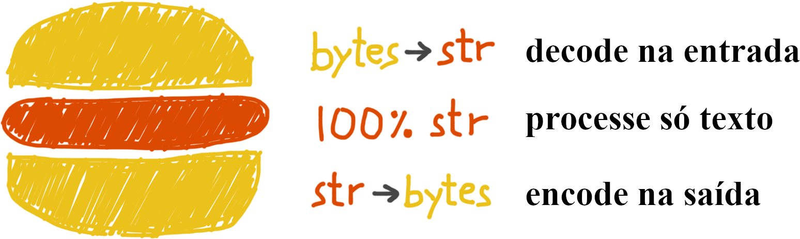

# Unicode versus Bytes

## String: sequência de caracteres

## Caractere: ponto de código, formatado em Unicode como 4 a 6 digitos hexadecimais

## bytes e bytearray: é um inteiro entre 0 e 255, e não uma string de um caractere.

### Tanto bytes quanto bytearray suportam todos os métodos de str, exceto aqueles relacionados a formatação 

## Codificação mais comum utf-8: é uma forma de codificar texto Unicode em bytes, permitindo representar praticamente todos os caracteres do mundo

## Processando arquivos de texto: "Sanduiche de Unicode":

### um programa deve decodificar bytes para str assim que os dados entram, trabalhar internamente apenas com texto Unicode e, no final, codificar o str de volta para bytes ao sair.

## Ordenação unicode: comparar pontos de código, normalmente em orem alfabética ou numérica

## O banco de dados unicode: 

### O padrão Unicode fornece todo um banco de dados—na forma de vários arquivos de texto estruturados—que inclui não apenas a tabela mapeando pontos de código para nomes de caracteres, mas também metadados sobre os caracteres individuais e como eles se relacionam.