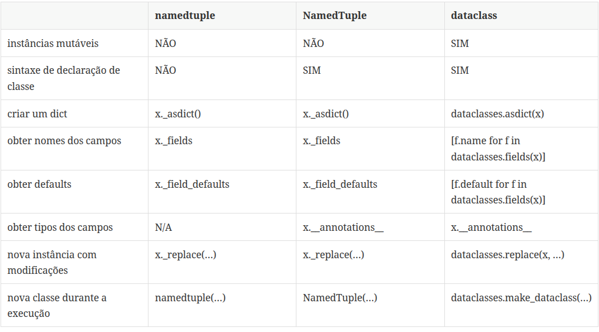

# Classes de dados:

## formas de representar objetos cujo principal papel é armazenar dados

## collections.namedtuple: Cria tuplas imutáveis com nomes nos campos.

### Cria subclasses de tuple, com nomes de campos, e um __repr__ informativo

## typing.NamedTuple: Evolução do namedtuple, com anotações de tipo.
## @dataclasses.dataclass: Cria classes mutáveis por padrão, com geração automática de __init__, __repr__ e __eq__.

